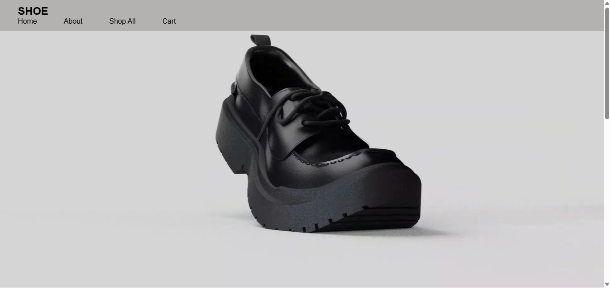

# SHOE-website

A multi-page e-commerce website for browsing and purchasing shoes, built using HTML, CSS, and JavaScript with a functional cart system using localStorage.

[**🔗Live Website**](https://kethnulee-weerasinghe4.github.io/SHOE-website/)



---

## Project Overview
The SHOE Website is a front-end e-commerce project designed to simulate a real online shoe store. It includes multiple pages such as Home, About, Shop, and individual product pages for detailed viewing.

Users can browse products by category (Men, Women, Kids), view detailed product information, select size and quantity, and add items to a shopping cart. The cart is managed using `localStorage`, allowing data persistence across pages and refreshes.

This project focuses on building core front-end development skills, including layout design, multi-page navigation, DOM manipulation, and basic state management without using frameworks.

---

## 4. Features
- Home page with video background
- Category-based navigation (Men / Women / Kids)
- Product listing page (Shop All)
- Individual product detail pages
- Add to Cart functionality
- Cart persistence using localStorage
- Cart sidebar with:
  - Product details
  - Quantity tracking
  - Total price calculation
  - Remove item option
- Multi-page navigation system

---

## 5. Tech Stack

### Frontend
- HTML
- CSS
- JavaScript

### Backend
- None (Frontend-only project)

---

## Installation

### Run Locally
Clone the repository:
```bash
git clone https://github.com/Kethnulee-Weerasinghe4/SHOE-website.git
cd SHOE-website
